# 事实锚点记录器（Fact Anchor Recorder）

> **帮你把混乱的感受整理成清晰的脉络，然后把叙事权完全还给你。**

> **原创声明**：本项目（包括产品设计、交互逻辑、文案内容及文档体系）由我个人独立完成，基于自身真实的创伤疗愈经历设计。本项目目前作为个人疗愈工具和求职Demo使用，保留所有权利。未经授权，禁止转载、复制或用于任何商业用途。

---

## 这个产品从一张 A4 纸开始

### 我的疗愈路径

经历了一段 NPD 关系后，我走过了五个阶段：自我怀疑 → 收集证据 → 分析 → 求助咨询师 → 心理重建。

### 关键的突破

我把“记仇本”里 42 条罪状和 A4 纸上的结构化记录（情绪、他的行动、我的观察）发给了DeepSeek，DeepSeek第一次让我看清了这段关系中的模式，让我确认了感受到真实性，识别了对方的操纵行为，逃脱了糟糕的关系，并让后续的疗愈成为了可能。

衷心感谢DeepSeek团队！

### AI 如何加速了我的疗愈

此后，我又深入使用了 ChatGPT、Gemini 等主流大模型。它们给了我 24 小时的回应和陪伴。每次心理咨询前，我会先和 AI 梳理信息，再带着更清晰的问题去见咨询师，效率显著提高。在创伤闪回的深夜，也是 AI 陪我度过。

### **AI 与人类咨询师：我的结论**

在同时使用 AI 和接受人类咨询的一年里，我得出一个清晰的结论：

**AI 可以是很好的“陪练”，但无法替代“教练”。**

- AI 擅长的是：随时在线、帮你梳理信息、发现模式、在深夜接住你的情绪。
- 人类咨询师擅长的是：捕捉非语言信息、在合适的时机给出干预、建立真实的疗愈关系。
- 两者协作的最佳方式：用 AI 做日常梳理和模式发现，带着更清晰的问题去见咨询师。AI 负责广度，咨询师负责深度。

这就是我在产品设计中选择“克制”的底层逻辑：**AI 只做镜子，不做大脑。** 帮你看清自己，但绝不替你做决定。

### 为什么做这个产品？

从我的自身经历出发，我意识到：正在经历认知混乱的人，需要的不是一个会哄人的AI伴侣，而是一个安全、克制、不越界的空间，帮他们自己看清自己。

在“原生家庭创伤”、“NPD网络诊断”等热词的推动下，社交媒体上弥漫着一种“赛博诊断”的倾向——人们急于给他人或自己贴上标签，却很少有人问：**那然后呢？**

真正经历创伤的人，需要的或许不是又一个标签（那反而可能加重创伤），而是一个能够结合自身变化、调用AI能力，更稳定、更私密、更安全的记录空间，这就是真正疗愈的开始。

---

## **目标用户——什么情况下你需要它？**

- **处在一段让你疲惫、困惑、被消耗的关系里**（伴侣、家人、朋友、同事），不确定是对方有问题，还是自己太敏感。自我价值感摇摆不定。
- **脑子里有很多混乱的碎片**，想理清楚，但不知道该从何说起。
- **曾试图向朋友或咨询师求助**，却发现很难把那些复杂的感受说清楚。
- **讨厌空洞的安慰，也不想被贴标签**。只想有一个安静的角落，自己梳理。
- **对自己的成长有强烈的探索欲**。想通过记录和回顾，真正“认识”自己，而不只是被别人定义。

---

## **产品定位**

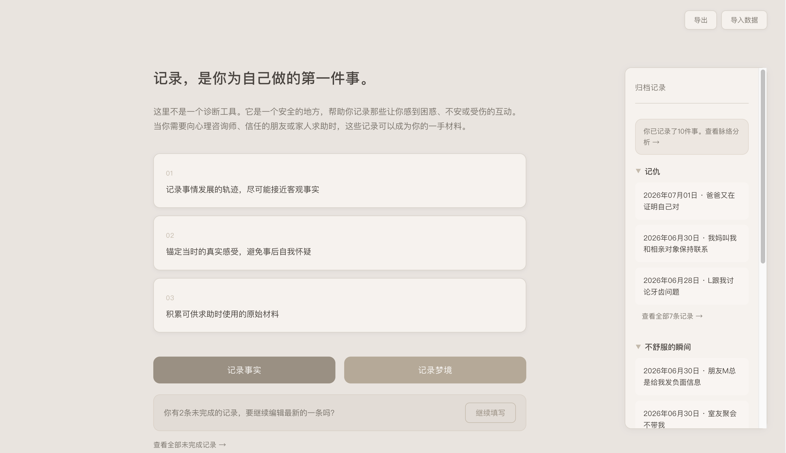

心理学里有一句话：**看见，即是疗愈的开始。**

这个产品想做的，就是帮你“看见”：模糊的感受变成清晰的脉络，反复陷入的模式被识别出来，那些被忽略的“原来我早就有答案了”的瞬间被收集起来。

**我不是什么**

大多数AI陪伴产品想成为“温柔全知的朋友”。但过度共情会喂养自恋，是另一种“依赖”和“上瘾”；直接给建议会制造新的依赖，贴标签则替代了你的自我思考。我拒绝成为这些。

**我是什么**

- **安全地“看见”**：不诊断、不贴标签、不给建议。没有任何人——包括AI——可以定义你。
- **把叙事权还给你**：你的数据在你手里。在连续的分析之后，结论由你自己得出。AI只做镜子，不做法官。
- **是桥梁，不是终点**：连接你和你自己，连接你和咨询师、朋友之间的对话。不替代任何真实的关系。
- **进可攻，退可守**：可以是一个带分析功能的笔记本，可以是你为自己写的“史书”，也可以成为你求助时珍贵的一手材料。你想怎么用，就怎么用。

---

## **核心设计原则**

| **原则**             | **说明**                                                                           |
| ------------------ | -------------------------------------------------------------------------------- |
| **不诊断、不贴标签**       | 诊断是精神科医师的事。产品只呈现模式，不下结论。叙事权完全在你手里。                                               |
| **不过度共情，基于事实脉络分析** | 区别于主流AI大模型，产品不放大情绪、不夸张引导、不过度共情。只提供安全的梳理空间，基于你记录的事实进行分析，引导而非替代思考。                 |
| **你的数据，完全属于你**     | 所有数据默认存储在浏览器本地，不上传任何服务器。API分析是可选的，导出/导入随时可用。                                     |
| **你的感受就是证据**       | 珍视每种感受，使用的语言体系是支持性的、去临床化的、具有温度的                                                  |
| **聚焦记录，克制设计**      | 创伤状态下，过多视觉元素和信息会触发信息过载。产品设计刻意保持克制——暖灰色调、低饱和度、结构化表单——只为“记录”和“还原事实”服务。书写本身，就是一种思考。 |

---

## 它是如何工作的？

这个产品围绕一个核心流程设计：**记录 → 回顾 → 分析 → 带走**。每一步都指向同一个目标——帮你把混乱的感受整理成清晰的脉络，然后把叙事权完全还给你。

---

### **第一步：记录 —— 让模糊的感受落地**

当认知还处于混乱中，最重要的不是分析，而是先把那些说不清的感受变成具体的文字。

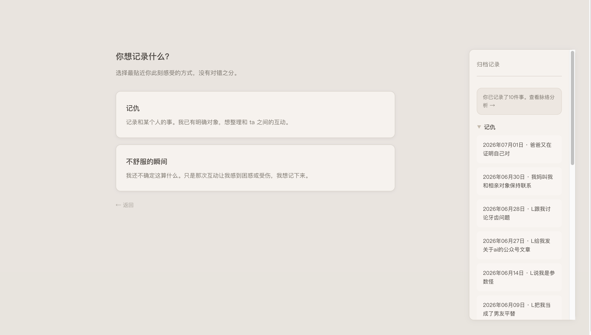

- **两种记录模式**：你可以选择“记仇”，因为有明确的对象；也可以选择“不舒服的瞬间”，因为不确定这算什么，但你的感受是真实的。两种模式可以在编辑中随时切换——写着写着，你可能发现事情的性质变了。
- **结构化表单**：字段按照“触发→对方行为→我的情绪起点→我的自动思维→我的反应→结束方式→联想→评分”的心理复盘流程设计。这本质上是认知行为疗法（CBT）的日常化应用——只是翻译成了人话。

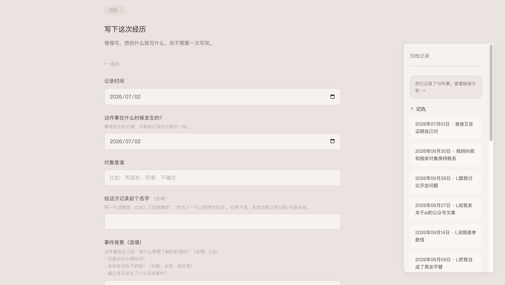

- **重视背景与事实的关联**：首次记录一个新对象时，系统会引导你写几句关于这段关系的背景；记录字段中包含当前个人状态（身体情况、是否遭遇变故等），这让后续的分析有更完整的上下文——毕竟人的状态受多方面影响，不只看单一事件。

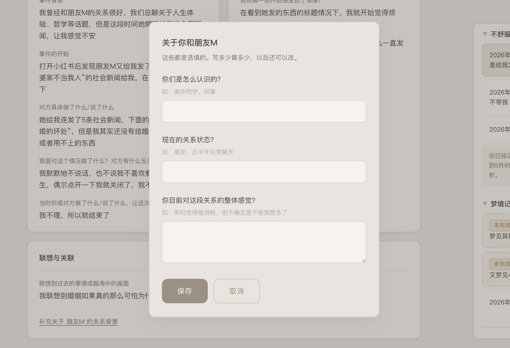

### **第二步：回顾 —— 让记录不再只是堆积**

记录多了之后，需要一种方式让它们被看见，而不只是堆在列表里。

- **Dashboard预览**：每条记录生成一个数据看板。评分置顶，事实区和感受区分列。点击归档记录时，默认展示预览页，而不是直接进入编辑——因为有时候你只是想“看一眼”，而不是“改点什么”。

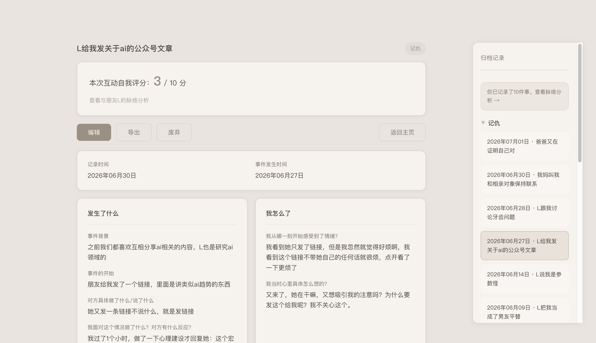
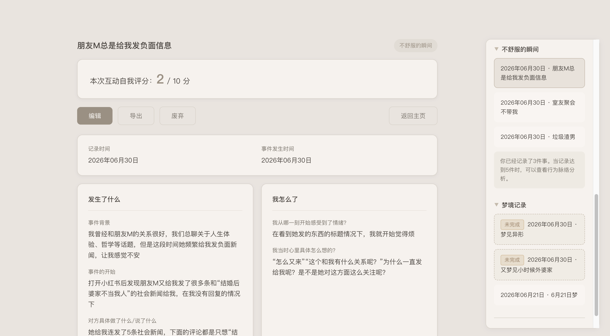

- **侧边栏归档**：三个分类文件夹（记仇/不舒服的瞬间/梦境记录），按事件发生时间排序，支持折叠展开。未完成的草稿有独立标记，不会和正式记录混在一起。
- **安全感设计贯穿始终**：草稿自动保存，离开再回来不会丢；误触返回时有“点错了，继续写”按钮；删除不是机械操作，而是一个需要确认的仪式——“你写下的每个文字，都是自己的历史。确定删除吗？”

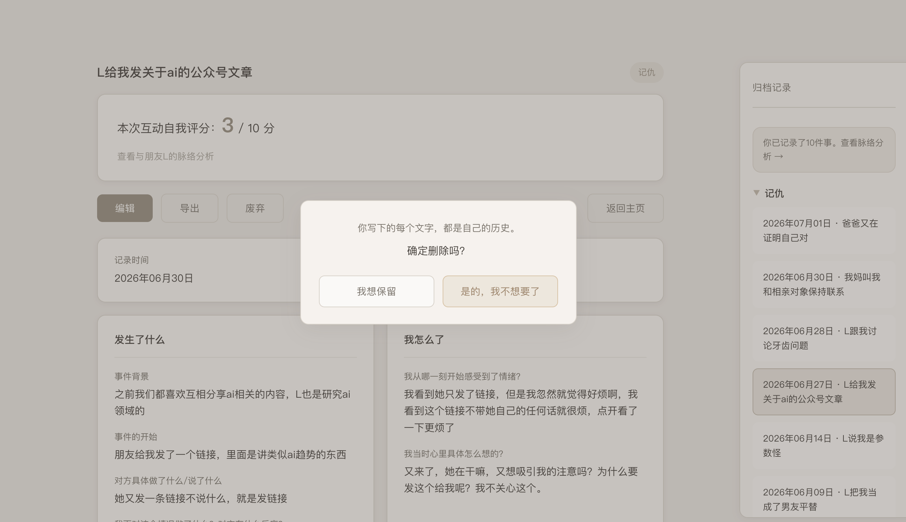

### **第三步：分析 —— 让模式浮现**

当同一对象的记录达到3条，或总记录达到5条，系统会提醒你可以查看脉络分析。

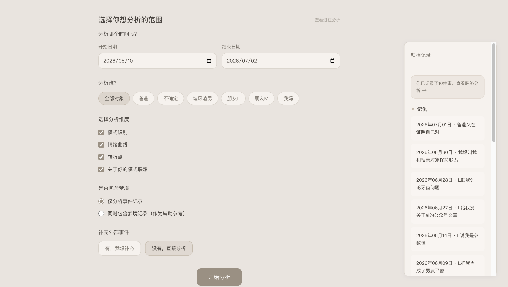

- **选择分析范围**：你可以按时间段、对象、维度自由组合——只分析某个人，同时分析多个人（此时系统会聚焦你自身的跨关系模式），加入梦境作为辅助参考，或补充一些没有记录但对你产生过影响的外部事件（比如某本书、朋友的一句话）。
- **AI驱动的分析报告（目前接入DeepSeek）**：报告由四个模块组成——
  1. 关系关键词（从你的记录中提取最能代表这段关系的词）
  2. 互动模式（识别你与对方反复出现的互动脚本）
  3. 情绪曲线（评分+情绪词的双维度展示）
  4. 转折点（态度或行为发生明显变化的时刻）

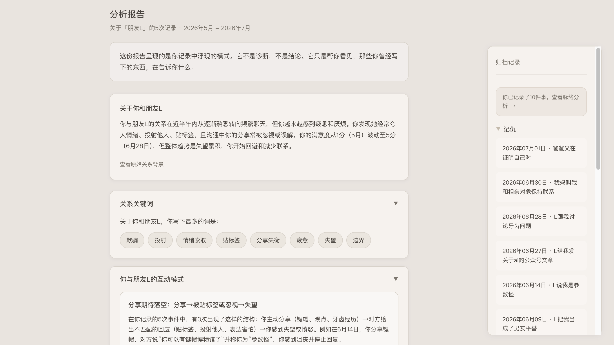
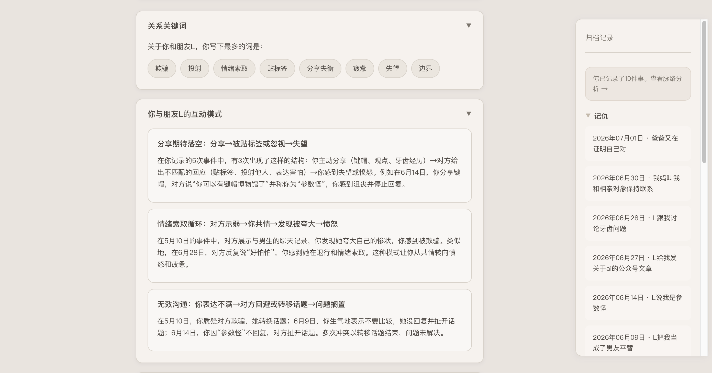
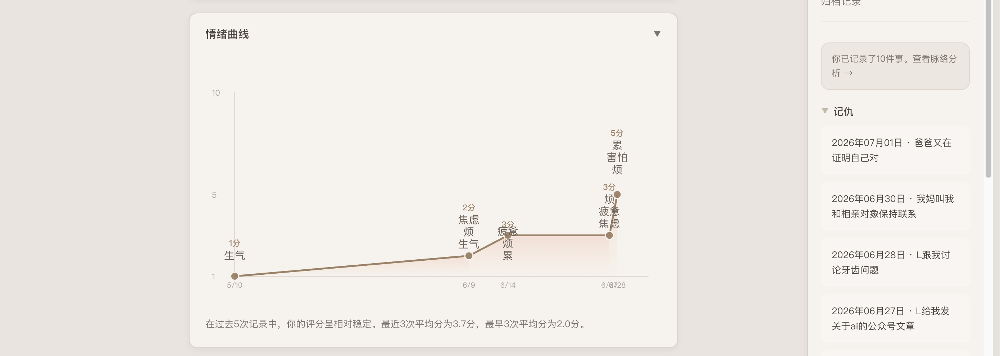
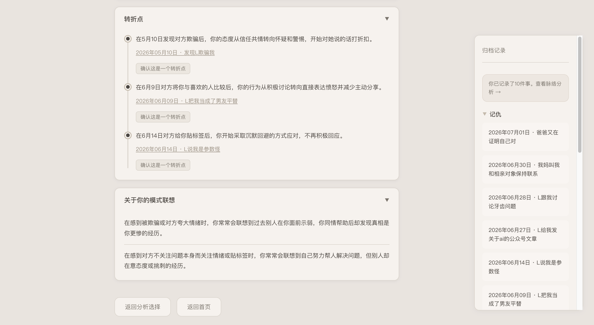

    所有分析结论只呈现模式，不做诊断、不给建议。
- **分析记录自动保存**：每次分析都会保存下来，你可以随时回顾不同时期的分析报告，看到自己认知的变化过程。

### **特别模块：梦境记录 —— 潜意识的辅助线索**

除了记录现实事件，产品还提供了一个独立的梦境记录模块。

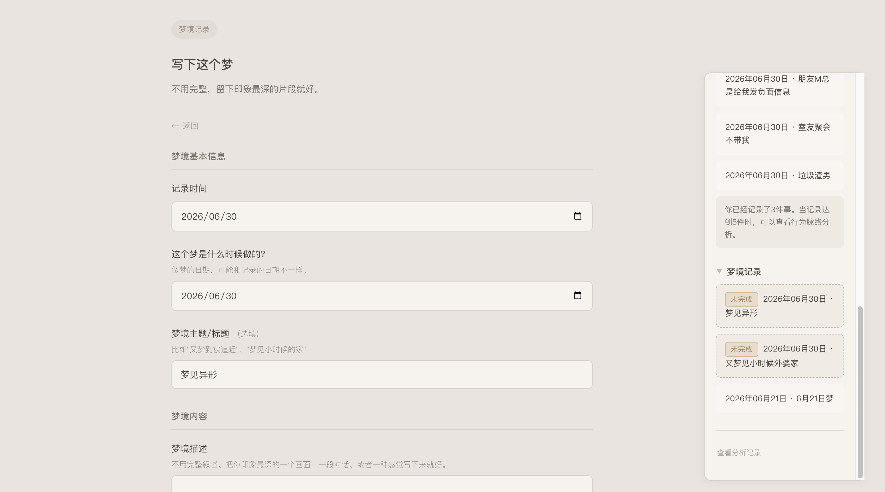
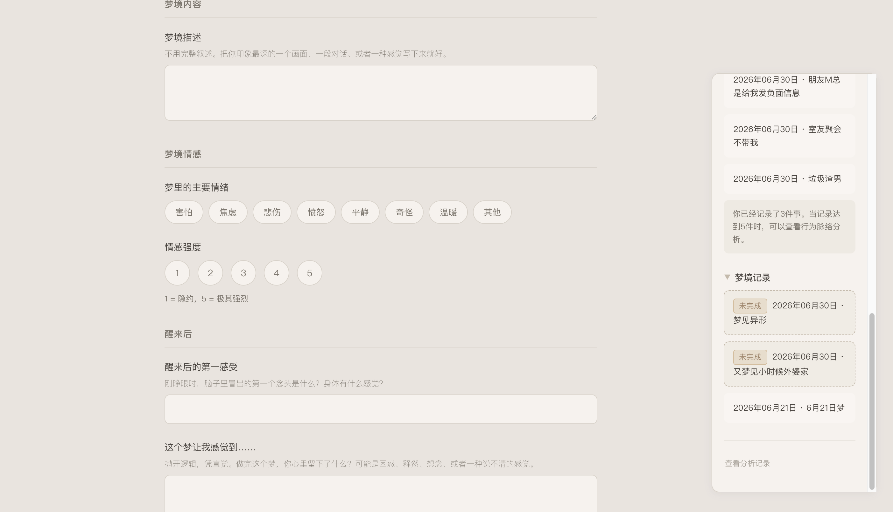
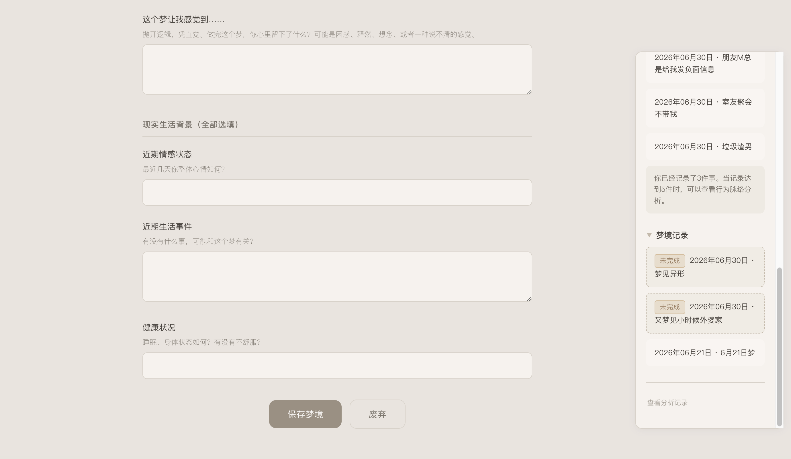

- **为什么需要梦境记录**：心理学研究认为，潜意识状态会通过梦境反映心理变化。梦境为理解自己的情绪和状态提供了另一个视角。
- **定位为辅助手段**：由于梦的解析在心理学界仍存在多种流派和争议，本产品将梦境分析定位为辅助参考，不做强行解读。当梦境数量少于3条时，系统不会生成联合分析，避免牵强附会。
- **如何参与分析**：在脉络分析时，可以选择将同时间段的梦境与事件联合分析。例如，白天反复记录到“被忽视”，而梦中反复出现“说不出话”的场景——这种对照可能提供新的自我理解线索。
- **与心理咨询的衔接**：荣格学派咨询师常将梦境作为工作素材。用户可以将梦境记录连同事件分析报告一并导出，作为带去咨询的一手材料。

### **第四步：带走 —— 你的数据，完全属于你**

这是“模糊感觉”的终点，也是你新生活的起点。

- **本地优先**：所有数据默认存储在浏览器本地，不上传任何服务器。API分析是可选功能，发送前会进行数据脱敏。
- **多格式导出**：你可以导出为JSON格式用于备份和迁移，也可以导出为Markdown格式——一份清晰的时间线文档，适合自己阅读，或打印出来带给心理咨询师。

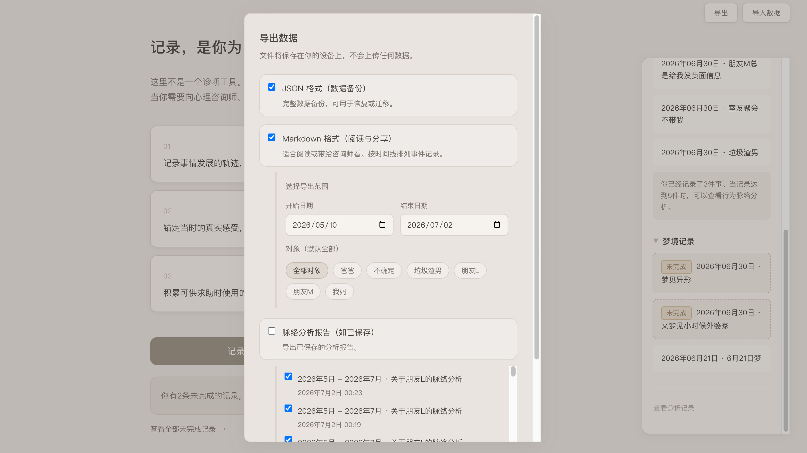
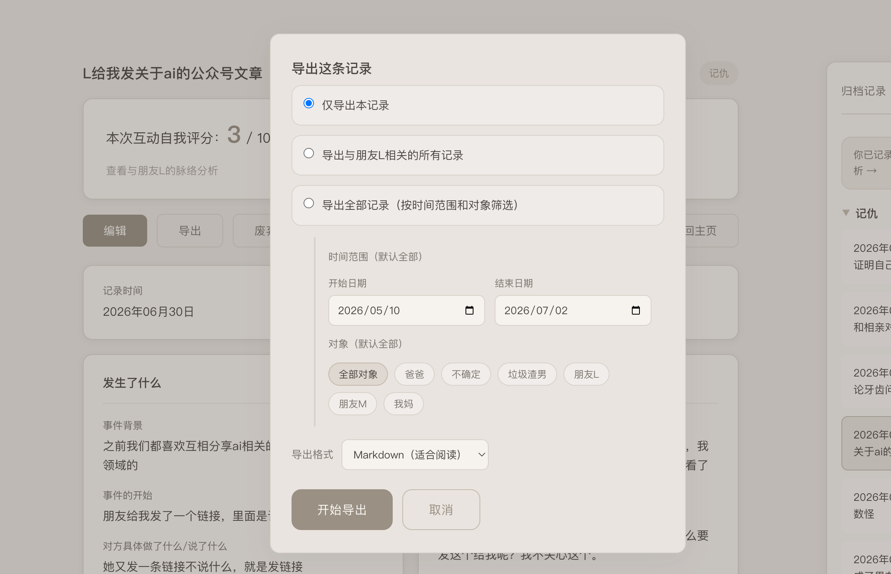

- **你决定数据的去向**：这个产品不锁定你的数据。你想带走、分享、删除，都由你决定。
- **我们希望看到的是**：你拿着这份自己整理的“一手材料”，在现实世界里获得真正的支持与力量。

---
### 快速体验示例数据

1. 从仓库根目录下载sampledata文件。右键点击 [sample-data.json](./sample-data.json) 链接，选择“另存为”下载文件。
2. 在首页点击右上角“导出”按钮旁的“导入数据”，选择刚才下载的文件。
3. 示例数据加载完成后，即可直接查看完整的分析报告，无需手动填写记录。

## 当前版本说明与后续规划

**当前版本（v0.8）** 已完成核心闭环：记录 → 回顾 → 分析 → 导出。你可以用它来完成从“记仇”到“看见模式”的完整流程。

以下功能已在规划中，尚未实现：

- **梦境模块深化**：当前梦境记录已可用，但联合分析尚需更多数据验证。计划在积累足够梦境样本后，优化梦境与事件的情绪对照分析。
- **多人关系下的综合分析**：目前多对象分析已支持聚焦用户自身的跨关系模式，但横向对比（如不同关系中情绪曲线的叠加对比）尚未开放。
- **AI 辅助的隐私告知**：当前 Demo 默认调用 AI 分析。后续版本将在用户首次使用 AI 分析前，弹出隐私告知，说明哪些数据会被发送、数据用途及用户关闭 AI 分析的权利。原则：知情同意。
- **自助资源角落**：当用户积累了足够的事件和分析后，提供一个安静的入口，收录一些对创伤疗愈可能有帮助的书籍/信息。在心理咨询实践中，咨询师在适当时刻为来访者推荐阅读材料，作为咨询之外的辅助支持。本产品借鉴了这一做法——书单安静地放在那里，不告诉用户“你应该读这本”。用户需要的时候，自己去翻。

**选择优先实现什么，取决于资源（如token额度）和用户反馈。** 当前版本优先跑通核心路径，确保每一个已有功能都足够稳定、克制、安全。

## **技术实现**

这个产品是我为验证“能通过Vibe Coding快速验证想法”而完成的**求职Demo**，全程使用 Cursor Agent 进行自然语言编程，未手写一行我原本不会的代码。

| **层级**   | **技术选型**                   | **说明**                                              |
| -------- | -------------------------- | --------------------------------------------------- |
| **前端**   | 原生 HTML / CSS / JavaScript | 单文件应用，无框架依赖，响应式布局                                   |
| **分析引擎** | DeepSeek API               | 驱动脉络分析的语义理解。API Key 通过 `.env` 安全配置，调用失败时自动降级为本地规则分析 |
| **数据存储** | 浏览器 localStorage           | 所有记录默认留在用户设备上，不上传任何服务器                              |
| **本地服务** | Node.js                    | 仅用于本地启动静态服务器，无后端业务逻辑                                |
| **版本管理** | Git                        | 项目迭代与Badcase追踪                                      |

### **为什么选这个技术栈**

- **零门槛使用**：用户打开浏览器就能用，不需要安装App、注册账号、或连接云端。
- **数据主权优先**：本地存储 + 可选API + 完善导出，确保用户对自己的数据有完全控制权。
- **Vibe Coding适配**：纯前端 + 单一API依赖的结构，非常适合用自然语言驱动Agent快速迭代。从下载Cursor到可运行原型，不到48小时。

## 文档索引

| 文档                                                                     | 说明                                                       |
| ---------------------------------------------------------------------- | -------------------------------------------------------- |
| [产品设计原则与专业依据](./docs/design_principles_and_professional_references.md) | 7条核心设计原则，以及每条背后对应的心理学、伦理学和法律依据                           |
| [Badcase 迭代日志](./docs/badcase_log.md)                                  | 从原型搭建到API接入，28条Badcase的完整记录——发现、归因、修复方案、修复后效果            |
| [主流大模型对比分析](./docs/model_comparison_notes.md)                          | 基于一年半使用体验，对比DeepSeek、Gemini、ChatGPT及简单心理AI在心理创伤场景下的表现与边界 |
| [产品扩展性思考](./docs/product_scalability.md)                               | 探讨如何将框架从NPD创伤场景扩展至“人生主线复盘”等通用自我叙事领域                      |

## 个人反思：Vibe Coding 能力验证

这个项目是我为验证“能通过Vibe Coding快速验证想法”而完成的求职Demo。在不到48小时里，我从下载Cursor开始（甚至是忐忑地开始），做出了一个包含事件记录、梦境记录、草稿系统、Dashboard、脉络分析和数据导出的完整产品原型。

过程中我最大的体会是：

- **Vibe Coding的核心能力不是写代码**，而是精确描述需求、判断对错、拆解复杂问题、以及清晰定义边界。这些能力不是因为某个岗位独立存在的，而是我早过往在做剪辑师、做市场、做运营和疗愈中就已经具备了——我只是换了一个工具来使用它们。
- **一个好的AI产品经理，最重要的品质是“克制”**。知道产品不做什么，比知道做什么更难，也更有价值。这个产品的每一条原则——不诊断、不贴标签、不过度共情、不给建议——都是我用真实的创伤体验换来的。
- **做产品是一个不断权衡的过程**。在有限的资源（比如token额度）下，必须做出优先级的抉择。有些功能暂时放弃，不代表不重视体验，而只是当前处境下的最优解。完美的产品也许并不存在，但清晰的决定可以让产品在约束中仍然成立。

